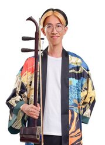

I am a final year Electrical & Biomedical Engineering student at University of Queensland. I have keen interest in organoid intelligence and regenerative medicine. Currently, my thesis project is about "Detecting and Classifying Neurofibromas using Deep Learning", supervised by Professor Brian Lovell.

 
 
